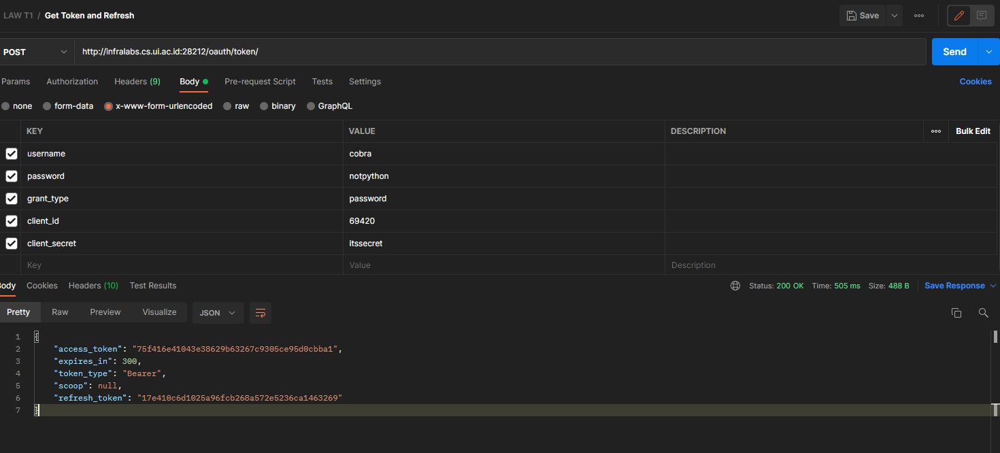
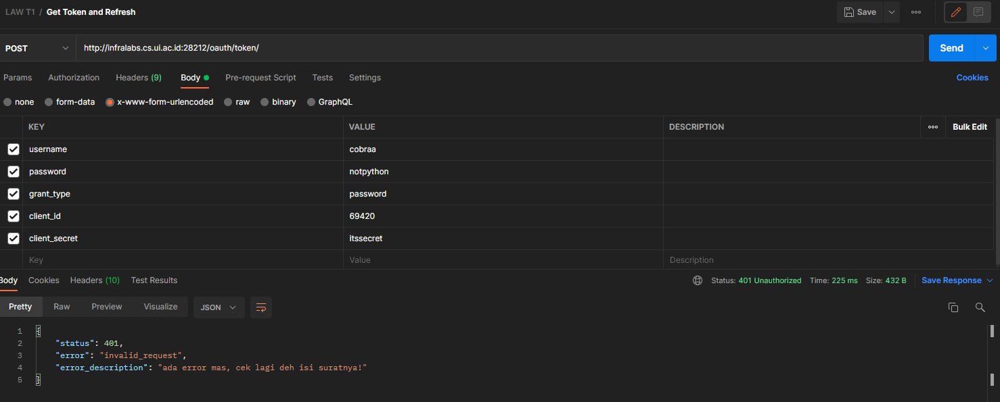
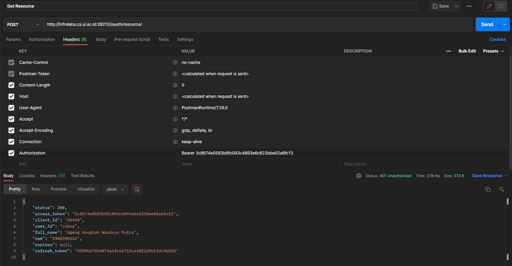
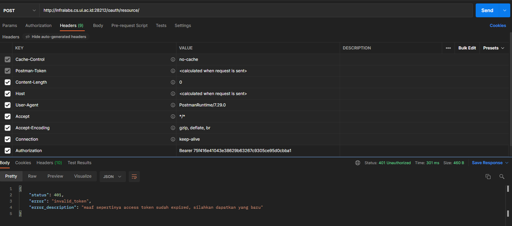
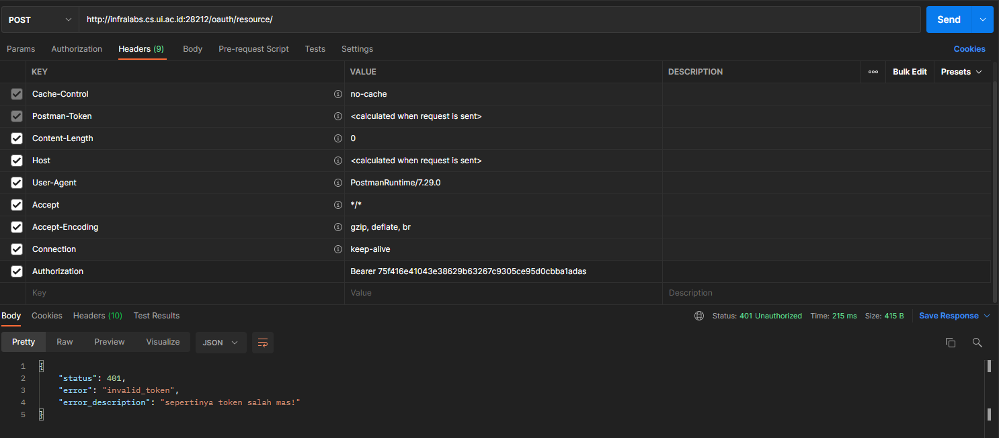

# API Documentation

## GET TOKEN

**URL** : `http://infralabs.cs.ui.ac.id:28212/oauth/token/`

**Method** : `POST`

**Payload** : `username, password, grant_type, client_id, client_secret`

## Success Response


```json
{
    "access_token": "75f416e41043e38629b63267c9305ce95d0cbba1",
    "expires_in": 300,
    "token_type": "Bearer",
    "scoop": null,
    "refresh_token": "17e410c6d1025a96fcb268a572e5236ca1463269"
}
```
## Fail Response

Ketika payload yang dikirimkan tidak sesuai dengan data yang ada



```json
{
    "status": 401,
    "error": "invalid_request",
    "error_description": "ada error mas, cek lagi deh isi suratnya!"
}
```

---

## Get Resource

**URL** : `http://infralabs.cs.ui.ac.id:28212/oauth/resource/`

**Method** : `POST`

**Headers** :`Authorization: Bearer {access_token}`

## Success Response



```json
{
    "status": 200,
    "access_token": "3c8674e0583b8fc093c4893e6c623bbe02a6fc13",
    "client_id": "69420",
    "user_id": "cobra",
    "full_name": "Ageng Anugrah Wardoyo Putra",
    "npm": "1906398212",
    "expires": null,
    "refresh_token": "9399bb703d074a6feeb715ce48f1d9b1fdc9d0fd"
}
```

---

## Fail Response

Ketika access token sudah expired



```json
{
    "status": 401,
    "error": "invalid_token",
    "error_description": "maaf sepertinya access token sudah expired, silahkan dapatkan yang baru"
}
```

## Fail Response 2

Ketika access token salah



```json
{
    "status": 401,
    "error": "invalid_token",
    "error_description": "sepertinya token salah mas!"
}
```